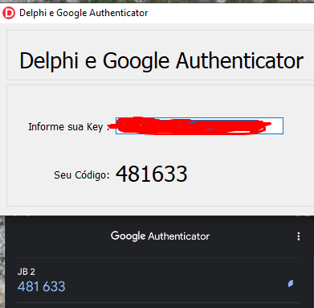

# Delphi-e-Google-Authenticator
 Verificação em duas etapas aumenta muito a segurança da sua conta, principalmente se a sua senha for roubada. Mas que tal adicionar essa funcionalidade na sua aplicação Delphi?
 
 # Na imagem abaixo está sendo sincronizado a Key com a aplicação OTP desenvolvida em Delphi
 
